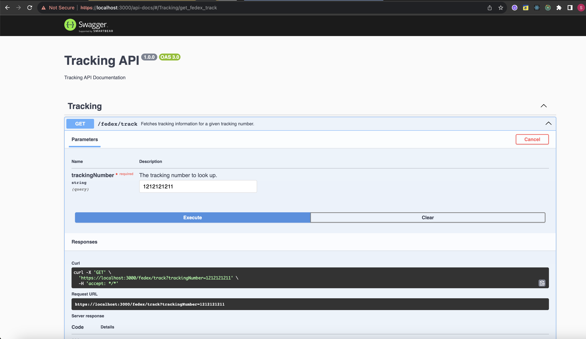

# FedEx API Tracker

## Table of Contents

- [Overview](#overview)
- [Prerequisites](#prerequisites)
- [Installation](#installation)
- [Environment Variables](#environment-variables)
- [Running the App](#running-the-app)
- [API Endpoints](#api-endpoints)
- [Swagger Documentation](#swagger-documentation)
- [Contributing](#contributing)
- [License](#license)

## Overview

This application provides an API to track FedEx shipments. It's built using Node.js, Express, and integrates with the FedEx API.

## Prerequisites

- Node.js v16.x or above
- npm v8.x or above
- A FedEx API account

## Installation

1. **Clone the repository:**

   ```bash
   git clone https://github.com/habeebahmed/javascript-basics.git
   ```

2. **Navigate to the project directory:**

   ```bash
   cd javascript-basics
   cd fedex-api-tracker-week-5
   ```

3. **Install the dependencies:**

   ```bash
   npm install
   ```

## Environment Variables

Create a `.env` file in the root directory and add the following variables:

```env
API_KEY_IPLOCATION=<API_KEY>
FEDEX_END_POINT="https://apis-sandbox.fedex.com"
CLIENT_ID=<CLIENT_ID>
CLIENT_SECRET=<CLIENT_SECRET>
```

## Running the App

To run the app in development mode, execute:

```bash
npm start

```

**The application will start running at https://localhost:3000**

## API Endpoints

- GET /track: Fetches tracking information for a given FedEx tracking number.
  - Query Params: trackingNumber
  - Response: JSON object with tracking details

## Swagger Documentation

**API documentation is available at https://localhost:3000/api-docs**



## Contributing

If you'd like to contribute, please fork the repository and make changes as you'd like. Pull requests are warmly welcome.

## License

MIT License. See [LICENSE](https://github.com/habeebahmed/javascript-basics) for more information.
